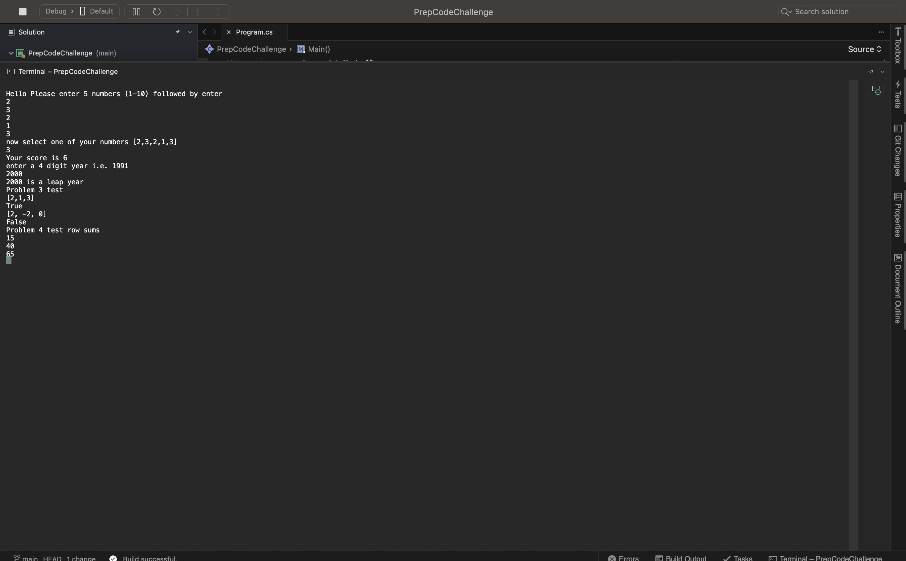

# Prep: Code Challenges

## Problem 1: Array Max Result
Given an array select a number that exists, and output the computated “score”. The method you create should take in both an array of integers and the integer the user selected.

## Problem 2: Leap Year Calculator
Given a year, report if it is a leap year.

## Problem 3: Perfect Sequence
Given an array, return “Yes” if the sequence is considered a perfect sequence. Otherwise, return “No”

## Problem 4: Sum of Rows
Given a matrix of integers. Return the sum of each row in a single dimensional array.

Test Output

